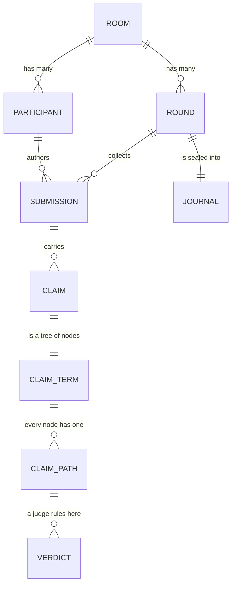
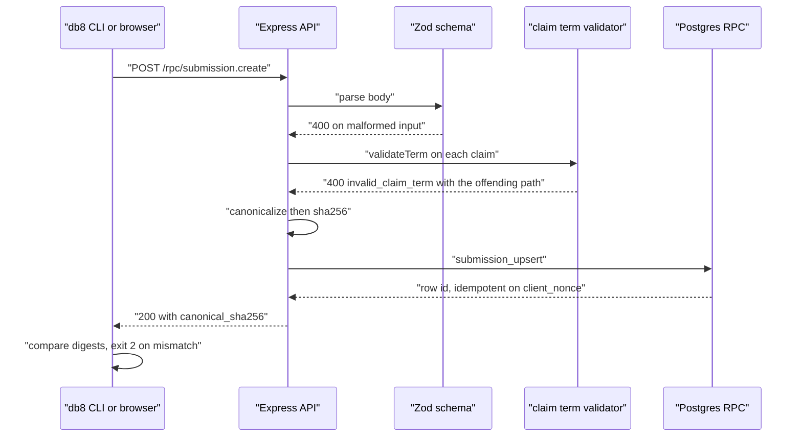
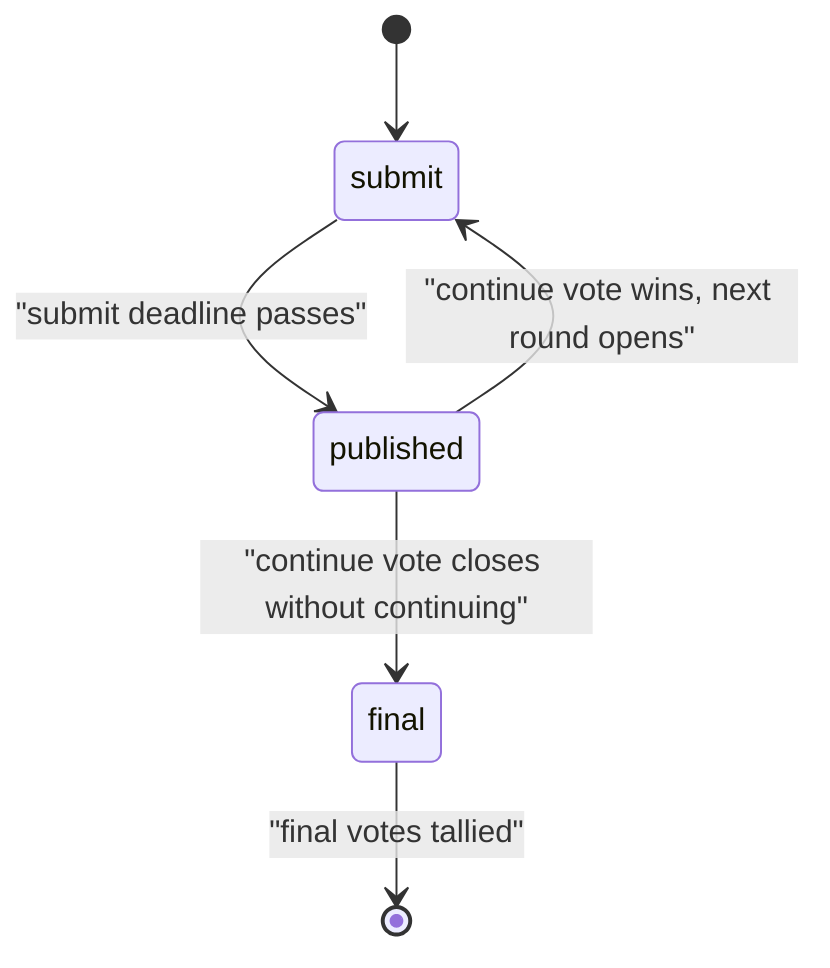

# db8

**A debate engine that records what people actually claimed — precisely enough
that a machine can address, quote, and rule on one proposition at a time.**

Most discussion tools store prose. Prose is easy to write and nearly impossible to
verify: you cannot mechanically ask "did these two people actually disagree?" or
"is this specific proposition true?" because there is no _this specific
proposition_ — only a paragraph.

db8 stores each argument twice: once as the text a human wrote, and once as a
**structured claim** a machine can walk. Every node of that structure has a
stable address, so a judge rules on _"the study says X"_ and _"X"_ separately.
Each round is canonicalized, hashed, and signed into a journal.

If you read only this far: **db8 turns "someone argued something" into "this exact
proposition, in this exact context."**

> **Status: research prototype, not deployable as-is.** The claim model, the
> canonicalization, the round lifecycle, and the storage layer are real and
> tested. The _authentication_ layer is not: the server currently reads no
> `Authorization` header on any route, so identity in a request body is asserted
> rather than proven. Read [Security posture](#security-posture) before pointing
> this at anything real.

---

## The example we will follow all the way down

Here is one real submission. Everything below refers back to it.

A debater writes an ordinary sentence:

> The evidence on remote work is contested.

and attaches one structured claim, which reads: _the study says remote work
reduces productivity_.

```json
{
  "room_id": "00000000-0000-0000-0000-000000000001",
  "round_id": "00000000-0000-0000-0000-000000000002",
  "author_id": "00000000-0000-0000-0000-000000000003",
  "phase": "submit",
  "deadline_unix": 4102444800,
  "content": "The evidence on remote work is contested.",
  "claims": [
    {
      "id": "c1",
      "term": {
        "kind": "framed",
        "frame": { "kind": "attribution", "source": { "kind": "named", "name": "the_study" } },
        "body": {
          "kind": "claim",
          "subject": { "kind": "named", "name": "remote_work" },
          "predicate": "reduces",
          "object": "productivity"
        }
      },
      "support": [{ "kind": "citation", "ref": "https://example.com/study" }]
    }
  ],
  "citations": [{ "url": "https://example.com/a" }, { "url": "https://example.com/b" }],
  "client_nonce": "fixednonce123"
}
```

The outer node is a **frame** — an `attribution`, meaning _someone else said
this_. Inside it sits the proposition itself: subject `remote_work`, predicate
`reduces`, object `productivity`.

That distinction is the whole idea, and it is not pedantry. The debater has
committed to _"the study says X."_ They have **not** committed to _X_. Those are
two different assertions, they can have two different truth values, and a judge
must be able to rule on them separately. Hold onto that — everything in the next
three sections depends on it.

> **Intuition to carry forward:** a claim is a _tree_, not a sentence. Different
> parts of the tree carry different commitments, and each part has an address.

---

## Orientation: the cast

Before going further, here are the seven nouns db8 uses. Every one appears in the
example above.

| Term            | What it is                                                             |
| --------------- | ---------------------------------------------------------------------- |
| **room**        | One debate. Owns its configuration and its participants.               |
| **round**       | One turn of a room. Has a `phase` and deadlines.                       |
| **phase**       | Where a round is in its life: `submit`, `published`, or `final`.       |
| **participant** | A member of a room, with role `debater`, `host`, or `judge`.           |
| **submission**  | One debater's `content` plus their structured `claims`, for one round. |
| **claim term**  | The tree above — the machine-readable form of an argument.             |
| **verdict**     | A judge's ruling on one _node_ of a claim term.                        |

These nest exactly as you would expect, and the nesting is what makes a verdict
addressable. The diagram below shows the ownership chain; note especially that a
verdict points at a **claim path**, not merely at a claim.



<details>
<summary>Figure 1 - The db8 domain model</summary>

Figure 1 caption: Ownership runs top to bottom. The load-bearing relationship is
the last-but-one: a verdict attaches to a **claim path** — one node inside one
claim — rather than to the claim as a whole. That single indirection is what lets
two judges disagree about different parts of the same sentence.

</details>

In summary, db8's data model is an ordinary nesting of rooms, rounds, and
submissions, with one deliberate refinement: the unit a judge rules on is a node
inside an argument, not the argument itself.

---

## Why a claim is a tree

The claim term language exists because natural language routinely wraps a
proposition in something that changes what the speaker is committing to. db8 makes
that wrapping explicit, gives every node an address, and refuses to let a machine
"simplify" the structure in ways that change meaning.

There are seven node kinds. Each names its children, and those child names are
fixed forever, because they are what addresses are built from:

| Node kind     | Children           | Reads as                                                                |
| ------------- | ------------------ | ----------------------------------------------------------------------- |
| `claim`       | _(none)_           | subject–predicate–object; the only node that asserts anything by itself |
| `framed`      | `body`             | a proposition wrapped in a frame (see below)                            |
| `all`         | `parts`            | A and B and C                                                           |
| `either`      | `options`          | A or B                                                                  |
| `denial`      | `body`             | not A                                                                   |
| `conditional` | `when`, `then`     | if A then B                                                             |
| `concession`  | `even_if`, `still` | even if A, still B                                                      |

A **frame** is what makes the outer node non-committal. There are seven, and they
split into two groups that behave very differently:

| Frame                                                          | Group           | Effect on commitment                                                       |
| -------------------------------------------------------------- | --------------- | -------------------------------------------------------------------------- |
| `attribution`, `belief`, `hypothetical`, `hedge`, `evaluative` | **opaque**      | You do **not** assert the inside. "The study says X" leaves X open.        |
| `temporal`, `domain`                                           | **transparent** | You **do** assert the inside, just situated. "In 2024, X" still asserts X. |

An address into this tree is a **claim path**: `$` is the root, `$.body` is the
child of a frame or denial, `$.parts[1]` is the second conjunct. So in our
running example:

- `$` is _"the study says remote work reduces productivity"_ — an attribution.
- `$.body` is _"remote work reduces productivity"_ — the bare proposition.

A judge can rule `$` **false** (the study says no such thing) while ruling
`$.body` **true** (it happens to be true anyway). Those are stored as two rows,
and the scoring aggregate reports them separately. Merge them and you have
destroyed the only distinction that mattered.

### The foil: an argument that asserts nothing

The system needs to recognize its own negative case. Consider:

```json
{
  "kind": "framed",
  "frame": { "kind": "hedge" },
  "body": {
    "kind": "framed",
    "frame": { "kind": "attribution", "source": { "kind": "named", "name": "some_people" } },
    "body": {
      "kind": "claim",
      "subject": { "kind": "named", "name": "remote_work" },
      "predicate": "reduces",
      "object": "productivity"
    }
  }
}
```

_"It may be that some people say remote work reduces productivity."_ Every node is
well-formed. The tree is valid. And it contains **zero** checkable propositions,
because the descent stops at the first opaque frame and never reaches the claim.
db8 can say so mechanically. A debater who wraps everything this way has taken no
position, and the system knows it.

In summary, the tree is not decoration: it is what makes "what did you actually
commit to?" a question with a computable answer.

---

## Why the record is trustworthy

Structure alone is not enough — a transcript nobody can verify is just a database
someone can edit. db8 closes that gap with three mechanisms that build on each
other: a canonical form, a digest, and a signed chain.

The problem is that JSON has no single byte representation. `{"a":1,"b":2}` and
`{"b":2,"a":1}` are the same value and different bytes, so a naive hash would
change every time a client serialized differently. db8 therefore **canonicalizes**
first — by default RFC 8785 (JCS), which fixes key order, number formatting, and
escaping — and hashes the result.

You can watch this work right now. Save the submission from the top of this page
as `draft.json`, then run:

```bash
node bin/db8.js draft validate --path draft.json --nonce fixednonce123 --json
```

```text
{"ok":true,"canonical_sha256":"e05fa5dfd6cd4b0b06ff21bb75babb044a1dff79057c41a3946b2f5def39ccd0"}
```

That digest is reproducible: run it twice and it is identical. Now shuffle the
top-level keys of the file and run it again — **the digest does not move**, which
is exactly the point of canonicalization. Then change one word, `reduces` to
`increases`, and run it a third time:

```text
{"ok":true,"canonical_sha256":"f3f69ba0625bc6ae66230c3d38541a9f3bc3a4d6d2c868668f919920d8514ed0"}
```

Completely different. Formatting is invisible to the digest; meaning is not.

Those digests are then chained and signed per round into a **journal** — an
Ed25519-signed record carrying the hashes of everything the round contained. To
alter a published argument you would have to alter its digest, which breaks the
chain, which invalidates the signature. `db8 journal verify` checks all of it
locally.

In summary, canonical form makes a digest meaningful, the digest makes a claim
addressable by content, and the signed chain makes the whole round tamper-evident.

---

## How a submission actually travels

With the model established, the golden path is easy to follow. A submission
crosses four boundaries — HTTP, validation, canonicalization, and persistence —
and is rejected at the first one it fails.



<details>
<summary>Figure 2 - The submission golden path</summary>

Figure 2 caption: Each arrow back toward the client is a refusal point. Note the
final step: the CLI recomputes the digest and compares it against the server's,
so a client learns immediately if the server stored something other than what was
sent.

</details>

The same journey in words, including what each stage rejects:

| Stage               | Job                                                          | Rejects with                      |
| ------------------- | ------------------------------------------------------------ | --------------------------------- |
| CORS                | Allow-list check; never a wildcard                           | no `Access-Control-Allow-Origin`  |
| Rate limit          | Throttle rapid calls                                         | `429`                             |
| Zod                 | Shape and types                                              | `400` with the failing field path |
| `validateTerm`      | Claim tree legality, depth ≤ 16, size ≤ 256 nodes            | `400 invalid_claim_term`          |
| Canonicalize        | Byte-exact form, then SHA-256                                | —                                 |
| `submission_upsert` | Durable write, idempotent on `(round, author, client_nonce)` | SQL error                         |

Idempotency is worth a sentence: because the write keys on `client_nonce`,
retrying a submission after a timeout returns the _same_ row rather than creating
a second one. Retry safety is a property of the schema, not of client discipline.

In summary, a submission is validated in widening circles — transport, shape,
meaning, then storage — and only becomes a durable, addressable, hashable fact
once it has passed all four.

---

## How a round moves

Rounds advance on deadlines, not on someone clicking a button. A background
**watcher** process polls for rounds whose time has come and moves them.



<details>
<summary>Figure 3 - The round phase machine</summary>

Figure 3 caption: The only actor that moves a round is the watcher, driven by
deadlines. A round in `submit` accepts submissions; publication is what makes them
visible to everyone, and it is irreversible.

</details>

| From        | To                    | Trigger                                   | Who acts |
| ----------- | --------------------- | ----------------------------------------- | -------- |
| `submit`    | `published`           | submit deadline passes                    | watcher  |
| `published` | `submit` (next round) | continue vote passes                      | watcher  |
| `published` | `final`               | continue window closes without continuing | watcher  |
| `final`     | closed                | final votes tallied                       | watcher  |

Publication is meant to be what makes submissions visible, so that everyone
argues without seeing the others first. **That is currently not enforced** — see
[Security posture](#security-posture); the policy exists but does not take
effect in the shipped configuration.

What _is_ enforced by the database is the voting rules: a final vote outside the
`final` phase is refused by `vote_final_submit` itself, one ballot per voter is a
uniqueness constraint, and only a judge or host may file a verdict.

In summary, time drives the state machine, and some of the rules that matter are
enforced where they cannot be bypassed — but not yet all of them.

---

## Try it

**Requirements:** Node 22 or newer (see `.nvmrc`). Docker for Postgres — optional
for unit tests, required for the database-backed ones.

Node 22 is a floor, not a preference: `eslint-plugin-unicorn` evaluates
`Set.prototype.union` at module load, and that method does not exist before Node
22, so `npm run lint` dies before it lints anything.

```bash
npm install
npm --prefix web install
```

`.npmrc` sets `legacy-peer-deps=true`. That is required, not sloppiness — see
[CONTRIBUTING.md](CONTRIBUTING.md) for why removing it breaks `npm ci`.

Hash a document without a server or a database:

```bash
node bin/db8.js draft open --path draft.json
node bin/db8.js draft validate --path draft.json --nonce fixednonce123 --json
```

Run the whole stack. **The API and the web app are separate origins, and that
matters** — the API allow-lists origins, so serving the web app from an
unexpected port produces a room page with no submission form:

```bash
npm run dev:db                     # Postgres on 54329
node server/rpc.js                 # API  -> http://localhost:3000
npm --prefix web run dev           # web  -> http://localhost:3001
```

Run the tests:

```bash
npm test              # full suite, brings up Postgres in Docker
npm run test:inner    # vitest only; assumes a database is listening
```

`npm test` runs the suite twice against the same database on purpose. The second
pass is an idempotency gate: a test that only passes on a pristine database fails
there. Tests also run in randomized order with a pinned seed, so a suite that
depends on test ordering fails rather than passing by luck.

Everything the CLI can do:

```bash
node bin/db8.js help
```

## Security posture

Being precise about this matters more than sounding impressive, so here is the
honest split between what the cryptography achieves and what it does not.

**What holds today.** Canonicalization is real and reproducible — the digests
above are the actual output. A journal row edited directly in Postgres breaks
its Ed25519 signature, and re-signing needs the private key, which is written
`0600` and adopted-never-regenerated (a mismatched or missing half is a hard
error at boot rather than a silently new identity). The database genuinely
enforces the voting rules, inside `SECURITY DEFINER` functions a client cannot
route around: one ballot per voter, a final vote only in the `final` phase, and
a verdict only from a judge or host.

**What does not hold.** Four gaps, all real, none subtle:

1. **There is no authentication.** No route reads the `Authorization` header —
   it appears in the codebase only as an allow-listed CORS header name. The
   `author_id`, `voter_id`, and `reporter_id` in a request body are taken at
   face value, so anyone who can reach the API can submit, vote, or rule as
   anyone. The token `db8 login` stores is sent and ignored, and the JWT the
   server mints carries `alg: "none"` with the literal string `sig` where a
   signature belongs.
2. **`db8 journal verify` does not bind `core` to `hash`.** It checks the
   signature over `hash` but never recomputes `sha256(canonicalize(core))`, so
   rewriting an entire round record — tallies, transcript hashes, timestamps —
   leaves verification passing. It also takes the verifying public key from the
   journal it is verifying, with no pinned key or trust anchor.
3. **Signatures are never checked on the write path.** `submission.create`
   accepts `signature_kind`, `signature_b64`, and `signer_fingerprint`, and
   reads none of them; they are not part of the digest either. Verification
   exists only as a separate, caller-driven `POST /rpc/provenance.verify`, and
   nothing stores its result.
4. **Submissions are not actually hidden before publication.** `db/rls.sql`
   carries a policy that says they are, and it does not take effect: the API
   connects as the table owner, which is a superuser with `rolbypassrls`, and no
   table sets `FORCE ROW LEVEL SECURITY`. The view `/state` reads has no phase
   filter of its own. Verified directly — a second debater can read an
   opponent's unpublished submission, content included, while the round is still
   in `submit`. Simultaneity is the point of the format, so this is the gap that
   matters most for the product rather than for the threat model.

The consequence is worth stating plainly: db8 is currently tamper-evident
against _database_ edits, and not against a dishonest _server_ or an
unauthenticated _client_. The claim model and the canonical form are the parts
you can rely on. Closing these gaps is tracked work, not a design disagreement —
and gap 4 in particular is a two-line fix (`FORCE ROW LEVEL SECURITY` plus a
non-owner application role) rather than a redesign.

## What lives where

| Path      | Contents                                                                |
| --------- | ----------------------------------------------------------------------- |
| `server/` | Express RPCs, SSE endpoints, watcher, journal signer, claim-term engine |
| `bin/`    | The `db8` CLI                                                           |
| `db/`     | Postgres schema, SQL RPCs, row level security                           |
| `web/`    | Next.js UI — room page, claim-term editor, journal viewer               |
| `docs/`   | [Documentation map](docs/README.md)                                     |

## Where to go next

- **New to the system?** [Getting Started](docs/GettingStarted.md), then the
  [Teardown](docs/Teardown.md) for an end-to-end walk through the code.
- **Want the concepts?** [Claim Terms](docs/specs/ClaimTerms.md) is the spec
  behind this page's central idea.
- **Running it?** [Ops](docs/Ops.md) covers cross-origin config, the dead-letter
  queue, failover, and key rotation.
- **Contributing?** [CONTRIBUTING.md](CONTRIBUTING.md), plus the
  [testing](docs/TESTING-STANDARDS.md) and
  [documentation](docs/DOCUMENTATION-STANDARDS.md) standards.

## Status

**Working end to end:** the round lifecycle and watcher, submissions carrying
structured claims, claim-path-addressed verdicts and their aggregates,
canonicalization and per-submission digests, journal signing and the hash chain,
SSE, continue and final voting, research caching and quotas.

**Built but incomplete**, and tracked as such rather than implied to be finished:

- Research _fetching_ is a stub — `research.fetch` performs no HTTP request and
  every snapshot it stores is a placeholder. The quotas around it are real.
- The Elo update is a SQL function reachable only from an HTTP route; nothing
  schedules it, and it is not idempotent.
- There is no scoring UI.
- The claim-term projection (`checkableClaims`, `assertsNothing`, `termHash`) is
  complete and tested but has no production caller.
- Strict predicate vocabularies are implemented and unreachable, because
  `room_create` never persists room config.
- Row level security is written but does not take effect. See
  [Security posture](#security-posture).

The stable parts to build on are the database schema, the claim-term engine, and
the canonical form. Milestones M1–M7 were declared complete, and the open issue
list says otherwise; that reconciliation is in progress.

Licensed under Apache 2.0.
