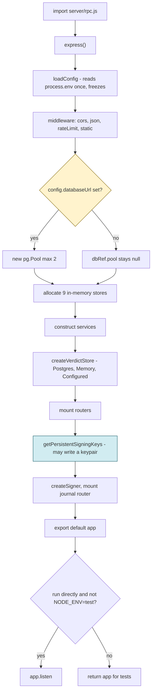
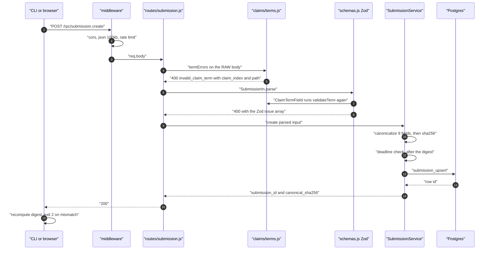
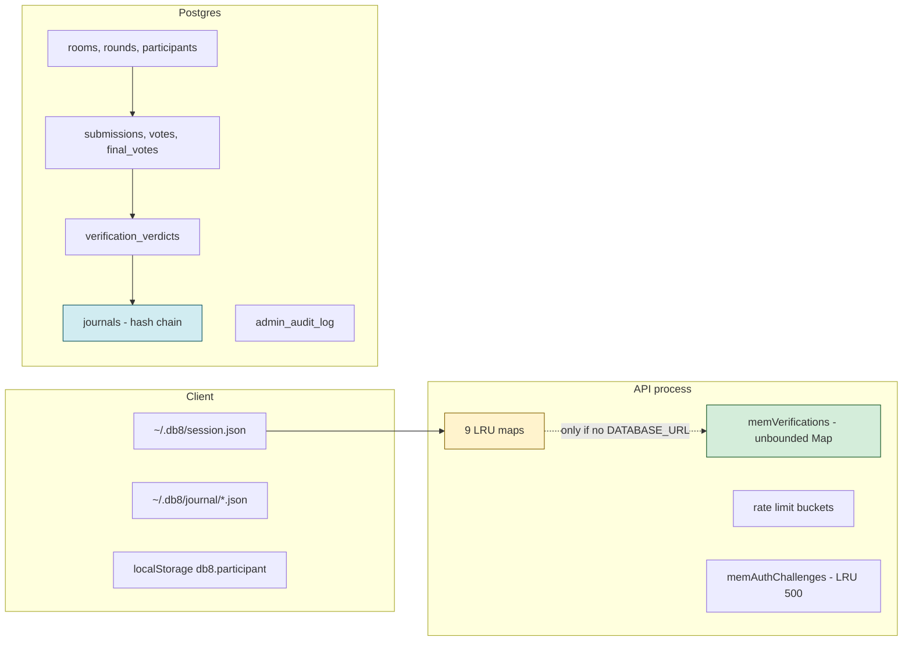
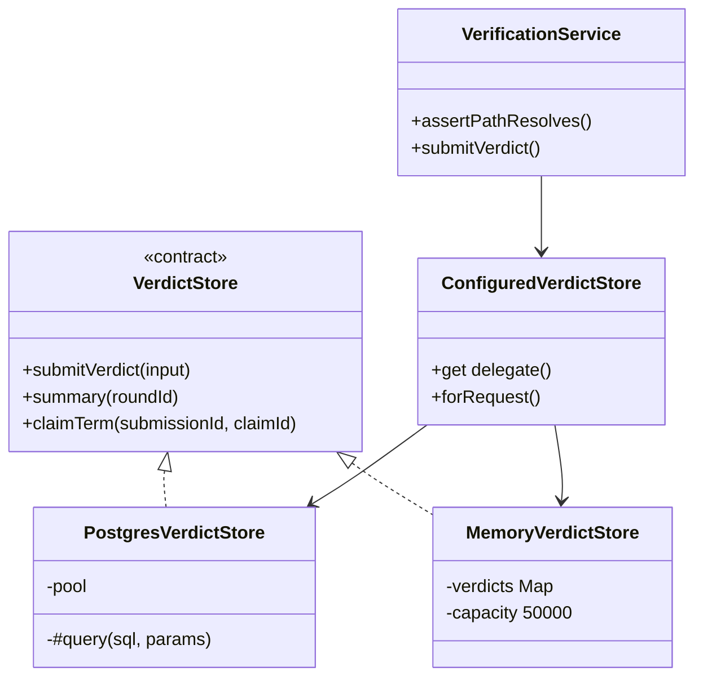
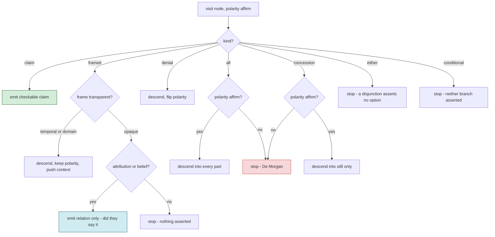
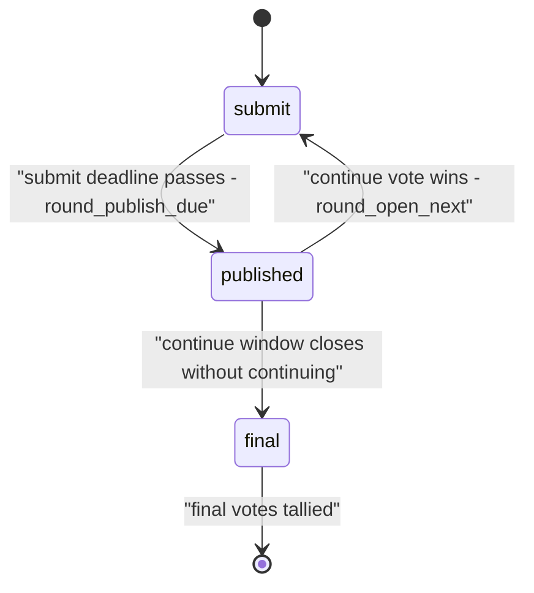
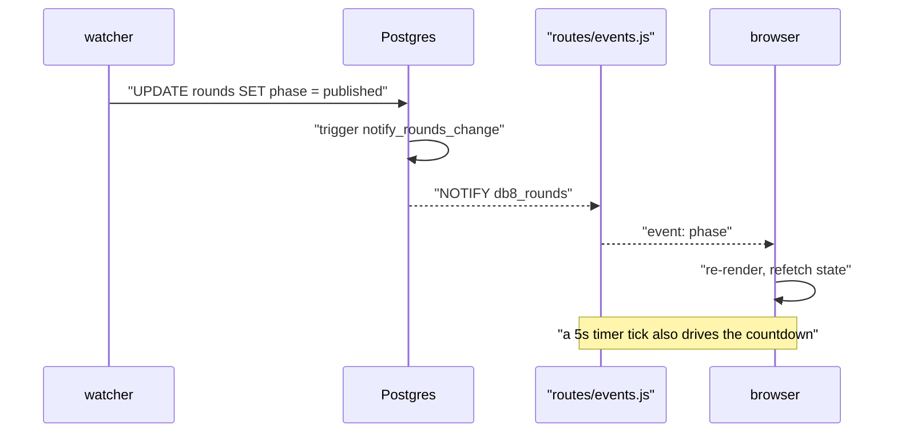
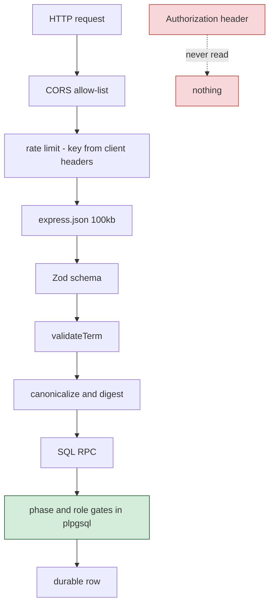

# db8 Teardown

An end-to-end technical explanation of db8 for a reader with no prior knowledge
of the project, its domain, or its internals. It starts at the process entry
point and works outward, introducing each concept before it is needed.

This is an **explanation**, not a specification. Where it describes a defect or
an unwired component it says so; the living specs under `docs/specs/` are the
contract. Every claim below is anchored to a file and line so you can check it.

---

## 0. Domain dictionary

db8 runs structured debates. Before any code, here is the vocabulary — every
term appears in the source with these exact meanings.

| Term                     | Meaning                                                                        |
| ------------------------ | ------------------------------------------------------------------------------ |
| **room**                 | One debate. Owns configuration and participants.                               |
| **round**                | One turn of a room. Carries a `phase` and deadlines.                           |
| **phase**                | `submit`, `published`, or `final`. The round state machine.                    |
| **participant**          | A member of a room, with role `debater`, `host`, or `judge`.                   |
| **submission**           | One debater's `content` plus structured `claims`, for one round.               |
| **claim**                | An `id`, a **claim term**, and `support` (citation, logic, or data).           |
| **claim term**           | An AST of what was asserted. Seven node kinds, described in §6.                |
| **frame**                | A wrapper that changes commitment — "the study says", "suppose that".          |
| **opaque / transparent** | Whether a frame suspends the proposition inside it, or merely narrows it.      |
| **polarity**             | `affirm` or `deny`. Flipped by a `denial` node.                                |
| **claim path**           | An address for one node in a term: `$`, `$.body`, `$.parts[1].body`.           |
| **verdict**              | A judge's ruling — `true`, `false`, `unclear`, `needs_work` — on a claim path. |
| **canonical form**       | The byte-exact serialization that gets hashed.                                 |
| **canon mode**           | `jcs` (RFC 8785) or `sorted`.                                                  |
| **journal**              | A per-round signed record: core fields, transcript hashes, `prev_hash`.        |
| **watcher**              | A separate process that advances rounds when deadlines pass.                   |
| **nonce**                | An idempotency key, and optionally a server-issued single-use token.           |

Two ideas do the heavy lifting, and everything else is machinery around them:

> **Intuition to carry forward:** (1) an argument is a _tree_ whose nodes have
> stable addresses, so a ruling attaches to a node rather than a paragraph;
> (2) a document has one _canonical_ byte form, so it can be hashed, and
> therefore signed and cited.

---

## 1. Bootstrapping: what happens before any request

db8 runs as **two Node processes plus Postgres**. The API server is
`server/rpc.js`; the watcher is `server/watcher.js`; the CLI (`bin/db8.js`) and
the Next.js web app are clients.

The first thing to understand about `server/rpc.js` is that it has **no
`createApp()` factory**. It is 246 lines of module-level side effects: importing
it builds the config, opens a Postgres pool, allocates every in-memory store,
constructs every service, mounts every route, and can generate a signing keypair
on disk. `export default app` at `server/rpc.js:242` hands back an Express app
that is already fully assembled.



<details>
<summary>Figure 1 - Bootstrap sequence of the API process</summary>

Figure 1 caption: Everything in this chart happens at `import` time. The two
highlighted nodes are the consequential branches: whether a database exists at
all (which selects memory mode for the whole process), and the key material
step, which can create files on disk as a side effect of an import.

</details>

The order and the line numbers:

| Step | Line                    | What happens                                                             |
| ---- | ----------------------- | ------------------------------------------------------------------------ |
| 1    | `server/rpc.js:30`      | `const app = express()`                                                  |
| 2    | `server/rpc.js:31`      | `loadConfig()` reads `process.env` once and freezes the result           |
| 3    | `server/rpc.js:32-35`   | `cors` → `express.json()` → `rateLimitStub` → `express.static('public')` |
| 4    | `server/rpc.js:38-47`   | `dbRef = {pool:null}`, then `new pg.Pool` if a URL is configured         |
| 5    | `server/rpc.js:67-79`   | Nine in-memory stores                                                    |
| 6    | `server/rpc.js:82-107`  | Services, including the verdict store trio                               |
| 7    | `server/rpc.js:154-180` | Routers mounted at root                                                  |
| 8    | `server/rpc.js:213`     | `createSigner({...getPersistentSigningKeys()})`                          |
| 9    | `server/rpc.js:244-246` | Conditional `app.listen`                                                 |

Two details that surprise people. First, `new pg.Pool()` **does not connect** —
it is lazy, so a wrong-but-parseable `DATABASE_URL` boots fine and fails on the
first query. Second, the pool is `max: 2`: two connections for the whole API.

### 1.1 The mutable pool holder

Every service reads the pool through a getter over a mutable holder, never a
captured reference:

```js
const dbRef = { pool: null };
// ...
export function __setDbPool(pool) {
  dbRef.pool = pool;
}
```

The reason is documented at `server/adapters/PostgresVerdictStore.js:8-10`: the
app is a module singleton, so tests cannot rebuild it with different config —
they mutate the live instance. A captured reference would keep using a pool that
had been replaced. This is test-only surface on a production module, and it is
the price of having no app factory.

In summary, bootstrapping is import-time and total: by the time you hold the
`app` object, every decision about persistence mode, keys, and routing has
already been made from environment variables that will never be read again.

---

## 2. Configuration: the levers

`loadConfig()` is the only sanctioned reader of `process.env` — a rule stated at
`server/config/secret-source.js:1` and violated in five other files. `CANON_MODE`
is the **only** value that can throw at boot (`server/config/config-builder.js:46-48`).

The variables that actually change behaviour:

| Variable                                    | Default              | Effect                                                                                                                                           |
| ------------------------------------------- | -------------------- | ------------------------------------------------------------------------------------------------------------------------------------------------ |
| `DATABASE_URL`                              | `''`                 | Non-empty selects Postgres for every service; empty runs the whole process in memory mode.                                                       |
| `NODE_ENV`                                  | `development`        | `production` makes guarded routes 503 without a pool. `test` stops the server binding a port and raises the rate limit to 1000/min.              |
| `CANON_MODE`                                | `jcs`                | Chooses the canonicalizer for every signed digest. Changing it after signatures exist invalidates all of them. Throws at import if unrecognized. |
| `ENFORCE_SERVER_NONCES`                     | `false`              | Requires a server-issued single-use nonce per submission.                                                                                        |
| `ENFORCE_AUTHOR_BINDING`                    | `false`              | With no enrolled fingerprint, rejects `author_not_configured` instead of accepting unbound.                                                      |
| `ENFORCE_RATELIMIT`                         | `0`                  | Misleading: the global limiter is already `enforce: true`, so this only matters under `NODE_ENV=test`.                                           |
| `DB8_ALLOWED_ORIGINS`                       | localhost:3001       | Browser CORS allow-list, never `*`.                                                                                                              |
| `SIGNING_PRIVATE_KEY_PATH`                  | `./.db8_signing_key` | **cwd-relative** — starting the server elsewhere mints a new identity.                                                                           |
| `SUBMIT_WINDOW_SEC` / `CONTINUE_WINDOW_SEC` | 300 / 30             | Memory-mode phase clock only.                                                                                                                    |

Two of these are traps worth stating outright. `ENFORCE_RATELIMIT` reads as
though rate limiting is off by default in production; it is on. And the signing
key path being cwd-relative means a process manager that changes working
directory silently strands every journal signed under the old key.

In summary, db8's behaviour is set entirely at import time from a dozen
variables, two of which are named in a way that invites the wrong conclusion.

---

## 3. The golden path: a submission

This is the path to understand first. A debater posts an argument; it comes back
with a digest. Between those two events it crosses four boundaries and is
rejected at the first one it fails.



<details>
<summary>Figure 2 - The submission golden path</summary>

Figure 2 caption: Note steps 4 and 7 — the claim term is validated **twice**, once
on the raw body before Zod and once inside the schema. That is deliberate, and
§3.1 explains why the duplication is load-bearing rather than sloppy.

</details>

The same journey as a table, with what each stage refuses:

| Stage                 | Source                                       | Rejects with                                                                             |
| --------------------- | -------------------------------------------- | ---------------------------------------------------------------------------------------- |
| CORS                  | `server/cors.js:35-74`                       | no `Access-Control-Allow-Origin` (the browser blocks; the server still runs the request) |
| JSON body             | `server/rpc.js:33`                           | `400` or `413`, as **HTML** — there is no error middleware                               |
| Rate limit            | `server/mw/rate-limit.js:52`                 | `429 rate_limited`                                                                       |
| Claim term pre-gate   | `server/routes/submission.js:36-40`          | `400 invalid_claim_term` with `details[]`                                                |
| Zod                   | `server/schemas.js:41-55`                    | `400`, `error` is a JSON-stringified issue array                                         |
| Canonicalize + digest | `server/services/SubmissionService.js:41-52` | —                                                                                        |
| Deadline              | `SubmissionService.js:54-58`                 | `400 deadline_passed`                                                                    |
| `submission_upsert`   | `db/rpc.sql:76-116`                          | SQL error, or memory fallback                                                            |

### 3.1 Why the claim term is validated twice

The pre-gate on the raw body looks redundant — the schema validates the term
too. It exists because of the order of failure:

```js
const invalid = termErrors(req.body?.claims);
if (invalid.length > 0) {
  return res.status(400).json({ ok: false, error: 'invalid_claim_term', details: invalid });
}
```

`server/routes/submission.js:37-40`. If this ran _after_ `SubmissionIn.parse`,
the schema's own `ClaimTermField` would already have thrown, so the gate would
always see valid claims, always return `[]`, and re-walk every term for nothing.
That is exactly what shipped in an earlier PR — a documented error the route
could never actually produce. The comment at `server/routes/submission.js:5-14`
records it, and an end-to-end test exists specifically to prove the gate can
fire, on the principle that _a route that cannot produce its own documented
error is not a gate_.

The deeper reason for the pre-gate is stack safety. `validateTerm` measures depth
and node count **before** handing anything to Zod (`server/claims/terms.js:281-296`),
because Zod recurses through a discriminated union and a deeply nested term would
blow the stack inside a function documented to return a validation result.

### 3.2 The digest is over nine fields, chosen explicitly

```js
const canon = canonicalizer({
  room_id: input.room_id,
  round_id: input.round_id,
  author_id: input.author_id,
  phase: input.phase,
  deadline_unix: input.deadline_unix,
  content: input.content,
  claims: input.claims,
  citations: input.citations,
  client_nonce: input.client_nonce
});
const canonical_sha256 = sha256Hex(canon);
```

`server/services/SubmissionService.js:41-52`. The object is rebuilt as an
explicit literal rather than passing `input` through, which quietly excludes the
three signature fields the schema accepts. That has a consequence worth naming:
**the signature fields are not covered by the digest, and no code on this path
reads them.**

Note also that the deadline check happens _after_ the digest, and trusts
`input.deadline_unix` from the request body rather than the round's actual
`submit_deadline_unix`. A submitter picks their own deadline, and `0` disables
the check entirely.

### 3.3 Idempotency

`submission_upsert` keys on `(round_id, author_id, client_nonce)` and, on
conflict, updates only `canonical_sha256` (`db/rpc.sql:100-102`). Retrying after
a timeout returns the same row — retry safety is a property of the schema, not
of client discipline. The sharp edge is that a _modified_ replay under the same
nonce overwrites the stored digest while leaving `content` stale.

In summary, a submission is validated in widening circles — transport, shape,
meaning, then storage — and the two apparent redundancies in that path (double
term validation, explicit field literal) are both deliberate defenses against
failures that actually shipped.

---

## 4. Where the state lives

At any moment, db8 state is in one of three places, and knowing which is the
difference between a durable fact and a process-local guess.



<details>
<summary>Figure 3 - Where state lives</summary>

Figure 3 caption: The amber block is the hazard — every in-memory store except
one is an LRU with a hard cap, so entries silently evict. The green block is the
single deliberate exception, and the blue block is the only tamper-evident store.

</details>

| Store               | Bound               | Consequence of eviction                                                 |
| ------------------- | ------------------- | ----------------------------------------------------------------------- |
| `memSubmissions`    | LRU 1000            | A later verdict on an evicted submission returns `submission_not_found` |
| `memRooms`          | LRU 100             | Room state is regenerated from defaults                                 |
| `memIssuedNonces`   | LRU 5000            | A validly issued nonce stops being valid                                |
| `memAuthChallenges` | LRU 500             | An unexpired challenge cannot be completed                              |
| `memVerifications`  | **unbounded `Map`** | — (deliberate; see below)                                               |

The verdict store is the one exception, and the reasoning is explicit at
`server/rpc.js:70-73`: an LRU _"would evict older verdicts once a round exceeded
its limit and the summary would quietly report fewer findings than were filed."_
Instead of evicting, the memory adapter **refuses** at capacity —
`verdict_capacity_reached` at 50,000 (`server/adapters/MemoryVerdictStore.js:74`)
— while still answering a repeat of an existing verdict so retry-after-timeout
stays idempotent.

That trade is the model for the whole subsystem: **losing a judge's finding
silently is worse than failing loudly.**

In summary, Postgres is the only durable store; everything in the API process is
capped and lossy by design, with exactly one component held to a stricter
standard because its data cannot be reconstructed.

---

## 5. Ports and adapters: the one place persistence is a choice

Most services in db8 decide between Postgres and memory by catching an
exception. The verdict subsystem does not, and the difference is the most
instructive piece of architecture in the codebase.



<details>
<summary>Figure 4 - The VerdictStore port and its adapters</summary>

Figure 4 caption: `VerdictStore` is deliberately not a base class — it is a
JSDoc contract plus a runtime duck-type check, so no adapter can inherit an
implementation and skip the shared test suite.

</details>

Three design choices are worth pulling out.

**The port is not a class.** `server/ports/VerdictStore.js:8-11` says why: _"a
base class would let an adapter inherit an implementation and silently skip that
suite."_ What exists instead is a list of required methods and a checker:

```js
export const VERDICT_STORE_METHODS = Object.freeze(['submitVerdict', 'summary', 'claimTerm']);

export function assertVerdictStore(store, label = 'store') {
  for (const method of VERDICT_STORE_METHODS) {
    if (typeof store?.[method] !== 'function') {
      throw new Error(`${label} does not implement VerdictStore.${method}`);
    }
  }
  return store;
}
```

Called once in `VerificationService`'s constructor, so a missing method fails at
composition rather than on the first request that needs it.

**Selection routes on configuration, never on failure.** The whole factory is
one getter:

```js
get delegate() {
  return this.dbRef.pool ? this.durable : this.memory;
}
```

`server/adapters/ConfiguredVerdictStore.js:24-26`. The header comment states the
policy: _"a configured database that errors surfaces `database_unavailable` from
the Postgres adapter and the request fails. Answering from memory instead would
tell a judge their verdict was recorded when it was only held in a process about
to restart."_

**A rule the database enforced is not an outage.** This is the crux:

```js
async #query(sql, params) {
  try {
    return await this.pool.query(sql, params);
  } catch (err) {
    if (err?.severity) throw err;

    console.error('[PostgresVerdictStore] database unreachable:', err.message);
    const wrapped = new Error('database_unavailable');
    wrapped.cause = err;
    throw wrapped;
  }
}
```

`server/adapters/PostgresVerdictStore.js:33-46`. Postgres sets `severity` on
anything it _replied with_, whatever the SQLSTATE; a connection that never got an
answer has none. So `round_not_verifiable` and `reporter_role_denied` propagate
as `400` with their original error object intact, while a genuine outage becomes
`503 database_unavailable`. The test asserts on **object identity**, not message,
because _"a replacement error carrying the same text would pass while losing
`code`, `severity`, and everything a caller needs."_

### 5.1 The rule that stayed above the port

Deciding whether a claim path _resolves_ is domain logic, so it lives in the
service, above both adapters:

```js
const term = await store.claimTerm(input.submission_id, input.claim_id);
if (!term) throw new Error('claim_not_found');
if (atPath(term, parsePath(input.claim_path)) === undefined) {
  throw new Error('claim_path_not_found');
}
```

`server/services/VerificationService.js:36-41`. Resolving per-adapter would be two
implementations free to disagree. And because `verify_submit` does **not** re-check
the path, `forRequest()` pins one delegate for the whole operation so a pool swap
between the read and the write cannot validate against one store and persist
through another.

In summary, the verdict subsystem is the one place where "which database" is a
configured decision rather than an accident of error handling, and every piece of
it — the non-class port, the identity-preserving error test, the pinned delegate
— exists because a specific earlier version got it wrong.

---

## 6. The claim term: an argument as a tree

Now the conceptual core. A claim term is an AST with seven node kinds, and the
child slot names are frozen forever because addresses are built from them.

```js
export const CHILD_KEYS = Object.freeze({
  claim: [],
  framed: ['body'],
  all: ['parts'],
  either: ['options'],
  denial: ['body'],
  conditional: ['when', 'then'],
  concession: ['even_if', 'still']
});
```

`server/claims/terms.js:33-41`, with the comment: _"Ordered, because order is
meaning-bearing and the path grammar and the canonical form both depend on it."_
Every structural operation — validation, traversal, path resolution, path
enumeration — is driven from this one table, so adding a node kind cannot leave
one of them behind.

| Node kind     | Children           | Reads as                     |
| ------------- | ------------------ | ---------------------------- |
| `claim`       | _(leaf)_           | subject–predicate–object     |
| `framed`      | `body`             | a proposition inside a frame |
| `all`         | `parts`            | A and B                      |
| `either`      | `options`          | A or B                       |
| `denial`      | `body`             | not A                        |
| `conditional` | `when`, `then`     | if A then B                  |
| `concession`  | `even_if`, `still` | even if A, still B           |

Frames split into two groups, and this split is the whole point:

| Frame                                                          | Group       | Commitment                      |
| -------------------------------------------------------------- | ----------- | ------------------------------- |
| `attribution`, `belief`, `hypothetical`, `hedge`, `evaluative` | opaque      | suspends the proposition inside |
| `temporal`, `domain`                                           | transparent | narrows it, still asserts it    |

### 6.1 Non-factive projection

`server/claims/checkable.js` answers one question: _given a term, which
propositions did the author actually commit to?_ It is a single descent carrying
`(node, path, polarity, context)`, with two callbacks so that the two exported
questions cannot disagree about what counts as asserted position.



<details>
<summary>Figure 5 - The projection decision tree</summary>

Figure 5 caption: The red node is the one that is easy to get wrong. Denial does
**not** distribute over conjunction or concession, and §6.2 shows what happens
when it does.

</details>

| Construct                   | Descends into               | Stops at                        |
| --------------------------- | --------------------------- | ------------------------------- |
| transparent frame           | body, accumulating context  | —                               |
| opaque relational frame     | —                           | body; emits the relation itself |
| opaque non-relational frame | —                           | everything                      |
| `denial`                    | body, polarity flipped      | —                               |
| `all`                       | every part, **if affirmed** | if denied                       |
| `concession`                | `still`, **if affirmed**    | if denied; `even_if` always     |
| `either`                    | —                           | always                          |
| `conditional`               | —                           | always                          |

### 6.2 Why denial must not distribute

Take `denial(all([A, B]))` — _"it is not the case that both remote work reduces
productivity and the release ships Tuesday."_

Naive De Morgan gives ¬(A ∧ B) ⟹ ¬A ∨ ¬B — a **disjunction**, not two
assertions. An earlier version emitted `{A, deny}` and `{B, deny}` as two
checkable findings. A checker then rules "false" on ¬B because the release _did_
ship Tuesday, and the author is scored as having made a false claim they never
made — while their actual claim (at least one of the two fails) may be perfectly
true.

The guard is one line:

```js
case 'all':
  if (!Array.isArray(node.parts) || polarity !== 'affirm') return;
```

`server/claims/checkable.js:91`. By the time `all` is reached under a denial,
`polarity` is `'deny'`, so the descent stops and the projection is empty —
correctly, because a disjunction commits the author to no particular option.

The concession case is the same shape: denying _"even if X, Y still holds"_
rejects the concessive relation, not Y.

### 6.3 The worked example

Our running term, _"the study says remote work reduces productivity"_:

- Path `$` is the `framed` node. Under an opaque `attribution` frame, projection
  does not descend — but the frame's **own relation** is asserted, so the finding
  at `$` is _"did the study say that?"_
- Path `$.body` is the `claim`. Its finding is _"is it true?"_

These take opposite verdicts and both be correct:

| Path     | Verdict | Means                                                     |
| -------- | ------- | --------------------------------------------------------- |
| `$`      | `false` | the study does not say that — the debater misquoted       |
| `$.body` | `true`  | it happens to be true, but not on that source's authority |

Under a flat text field both collapse into one ambiguous `false`.

The negative case matters too. `hedge(attribution(claim))` — _"it may be that
some people say X"_ — is a valid tree containing **zero** checkable propositions,
because the descent stops at the first opaque frame. `assertsNothing()` reports
this mechanically.

### 6.4 The caps, and why they count payload

`MAX_DEPTH = 16`, `MAX_NODES = 256`, both inclusive. The subtlety is that a
claim's `object` is arbitrary JSON, so it must count against the same budget:

```js
function measurePayload(value, depth, state) {
  if (depth > state.maxDepth) state.maxDepth = depth;
  state.count += 1;
  if (value === null || typeof value !== 'object') return;
  if (state.count > MAX_NODES || state.maxDepth > MAX_DEPTH) return;

  const children = Array.isArray(value) ? value : Object.values(value);
  for (const child of children) {
    measurePayload(child, depth + 1, state);
    if (state.count > MAX_NODES || state.maxDepth > MAX_DEPTH) return;
  }
}
```

`server/claims/terms.js:168-181`. Two recorded defects live in that function:
counting only containers made `Array(1e6).fill(0)` two nodes, and a deeply nested
payload raised `RangeError: Maximum call stack size exceeded` out of a function
documented to return a validation result. The early return is what stops the
walker visiting a million elements to report a limit it already knows is broken.

`__proto__` is refused anywhere in a payload (`terms.js:144-156`) because
_"terms are stored as authored and content-addressed, so a payload that comes
back mutated is the one outcome that cannot stand."_

In summary, the claim term is not decoration: it is what makes "what did you
commit to?" computable, and nearly every rule in it exists to stop a machine
attributing an assertion to someone who did not make it.

---

## 7. Paths: how an address stays valid

A path is a list of steps rendered as a string: `$`, `$.body`, `$.parts[1].body`.
`parsePath` is a _total_ parse — it returns `null`, not a partial result, if
anything does not consume cleanly:

```js
const re = /\.([A-Za-z_][A-Za-z0-9_]*)|\[(\d+)\]/g;
let consumed = 1;
while ((match = re.exec(text)) !== null) {
  if (match.index !== consumed) return null;
  consumed = match.index + match[0].length;
  steps.push(match[1] !== undefined ? match[1] : Number(match[2]));
}
return consumed === text.length ? steps : null;
```

`server/claims/paths.js:21-28`. `atPath` then follows only slots the node's kind
actually declares, so a wrong path returns `undefined` rather than landing on
arbitrary data — and a `null` from `parsePath` is rejected rather than coerced to
the root, because _"treating that as 'no steps' would let a bad verdict path
silently rule on the whole term."_

**Paths are stable for two reasons**, both structural: child order is frozen, and
terms are stored exactly as authored. Any future rewrite feature must carry a
path transport or every existing citation breaks.

### 7.1 The `$.parts[01]` bug

`Number('01')` is `1`, so `$.parts[01]` and `$.parts[1]` parse to the same steps.
But the path is _stored as a string_, and both the uniqueness index and the
summary aggregate group on that string — so the two spellings became two group
keys naming one node, splitting one finding into two half-counted rows.

The fix normalizes on the way in, at the schema boundary:

```js
claim_path: z
  .string()
  .refine((v) => parsePath(v) !== null, { message: 'claim_path must be a valid term path' })
  .transform((v) => formatPath(parsePath(v)))
  .optional(),
```

`server/schemas.js:155-161`. Round-tripping through `parsePath` → `formatPath`
_is_ the canonicalizer for paths.

In summary, an address is only useful if it means the same thing every time, and
db8 buys that with frozen child order, a total parser, and normalization at the
edge.

---

## 8. Canonicalization: why a document has one byte form

Ed25519 signs bytes, and JSON has no canonical byte form — key order, whitespace,
number formatting, and escaping all vary by serializer. Without a fixed
canonicalization, a verifier re-serializing a parsed document computes different
bytes than the signer did and every signature fails.

Two modes exist. `jcs` is RFC 8785, delegated to the `canonicalize` package.
`sorted` is the legacy form:

```js
export function canonicalizeSorted(value) {
  const seen = new WeakSet();
  const walk = (v) => {
    if (v === null || typeof v !== 'object') return v;
    if (seen.has(v)) throw new Error('Cannot canonicalize circular structure');
    seen.add(v);
    if (Array.isArray(v)) return v.map(walk);
    // Null prototype, because `out.__proto__ = x` on an ordinary object is a
    // prototype assignment, not an own property: the key vanishes and a payload
    // containing `__proto__` canonicalizes identically to one without it.
    const out = Object.create(null);
    for (const k of Object.keys(v).sort()) out[k] = walk(v[k]);
    return out;
  };
  return JSON.stringify(walk(value));
}
```

`server/utils.js:6-21`. The `Object.create(null)` is not style — without it,
`{a:1,__proto__:{}}` and `{a:1}` produce **the same digest**, which is a
signature-collision primitive.

### 8.1 The bug that motivated all of this

The CLI once carried its own canonicalizer whose `sorted` branch was:

```js
JSON.stringify(value, Object.keys(value).sort());
```

`JSON.stringify`'s second parameter, when an **array**, is a property allow-list
applied at _every depth_ — not a top-level key ordering. Built from the top-level
keys only, it deleted every nested key:

```text
CLI    : {"body":{"kind":"claim"},"frame":{"kind":"attribution"},"kind":"framed"}
SERVER : {"body":{"kind":"claim","object":"productivity",...},"frame":{...},"kind":"framed"}
```

Every claim and citation collapsed toward `{}`, so two entirely different
arguments produced the same digest, and anything signed under `sorted` failed
verification. Worse, the branch was reached for _anything not exactly `'jcs'`_,
so a one-character typo silently selected the content-erasing path.

The fix was structural: one implementation, imported by both sides, and a mode
resolver that throws rather than falling through:

```js
export function normalizeCanonMode(raw, { varName = 'CANON_MODE' } = {}) {
  const mode = String(raw ?? '')
    .toLowerCase()
    .trim();
  if (mode === '') return 'jcs';
  if (CANON_MODES.includes(mode)) return mode;
  const err = new Error(`Invalid ${varName}: '${raw}'. Allowed: ${CANON_MODES.join('|')}`);
  err.code = 'invalid_canon_mode';
  throw err;
}
```

`server/canon-mode.js:45-53`. The `err.code` tag is what lets the CLI classify a
typo as a **permanent** validation error rather than a retryable network one —
automation retrying `EXIT.NETWORK` would retry a misconfiguration forever.

### 8.2 A known divergence

`canonicalizeSorted` is **not** lexicographic for integer-like keys. JavaScript
emits integer-index properties first in ascending numeric order, silently
overriding `.sort()`, so `sorted` mode emits `{"2":..,"10":..}` where a
lexicographic sort — and JCS — emit `{"10":..,"2":..}`. It is reachable, because
a claim's `object` is arbitrary JSON.

This is self-consistent, so db8 verifies its own signatures. It is **not
interoperable**: an independent implementation of `sorted` doing a real
lexicographic sort computes a different digest. It is recorded as a labelled
divergence in `server/test/canonicalization.test.js` rather than fixed, because
resolving it changes every signature over a document with numeric keys.

In summary, canonicalization is the foundation the whole provenance story rests
on, and its history is a good argument for the project's rule that an invariant
gets exactly one implementation.

---

## 9. The round lifecycle and the watcher

Rounds advance on deadlines, not on user action. In DB mode the authority is a
separate process.



<details>
<summary>Figure 6 - The round phase machine</summary>

Figure 6 caption: Every transition is performed by the watcher, driven by
`*_unix` deadline columns. Publication is what makes submissions visible, and it
is irreversible.

</details>

| From        | To                    | Trigger                       | Actor                           |
| ----------- | --------------------- | ----------------------------- | ------------------------------- |
| `submit`    | `published`           | `submit_deadline_unix` passes | watcher → `round_publish_due()` |
| `published` | `submit` (next round) | continue vote passes          | watcher → `round_open_next()`   |
| `published` | `final`               | continue window closes        | watcher → `round_open_next()`   |
| `final`     | closed                | final votes tallied           | watcher                         |

The watcher also signs journals for any published round that lacks one, and
attempts to recover an abandoned barrier — though that recovery is currently
unreachable, because the watcher writes its own heartbeat one step before
testing for the absence of any heartbeat.

**A hazard worth knowing.** `round_publish_due()` and `round_open_next()` take
**no room argument** — they are database-global sweeps keyed on `WHERE phase =
...`. That is fine in production, where one watcher owns the database, but it
means any test or tool calling them affects every room. The test suite documents
this and works around it.

**Memory mode reimplements this state machine.** `RoomService` advances phases
itself when no pool exists (`server/services/RoomService.js:131-161`), which is
a second implementation of the same rules — the kind of duplication the project
elsewhere works hard to avoid.

### 9.1 Realtime

A trigger on `rounds` calls `notify_rounds_change()`, which `pg_notify`s the
`db8_rounds` channel. `server/routes/events.js` holds a dedicated pooled client
that `LISTEN`s on four channels — `db8_rounds`, `db8_journal`, `db8_verdict`,
`db8_final_vote` — and re-emits each as a named SSE event, alongside a 5-second
timer tick.



<details>
<summary>Figure 7 - A phase change reaching the browser</summary>

Figure 7 caption: The path is push, not poll — the browser learns about a phase
change because Postgres told the server, not because it asked.

</details>

In summary, time is the only thing that moves a round forward, the watcher is
the only actor that acts on time, and LISTEN/NOTIFY is what turns a database
write into a browser update.

---

## 10. Concurrency and failure

Three concurrency problems have actually bitten this codebase, and each fix is
instructive.

**Signing keys, concurrent start.** Twelve processes starting at once must
converge on one keypair. Opening the destination with `'wx'` is not enough,
because that creates an empty file first and a concurrent starter can read a
truncated key. The fix writes to a private temp file and **hard-links** it into
place:

```js
const tmpPath = `${privPath}.tmp.${process.pid}.${crypto.randomBytes(6).toString('hex')}`;
fs.writeFileSync(tmpPath, privateKey, { mode: 0o600 });
try {
  fs.linkSync(tmpPath, privPath);
} catch (e) {
  if (e.code !== 'EEXIST') throw new Error(`failed to persist signing key...`);
  // Lost the race; the winner's key is already in place and is adopted below.
}
```

`server/utils.js:143-159`. `link()` fails rather than clobbering, so exactly one
starter wins and the rest adopt its key. The key appears complete or not at all.

**The ABBA deadlock.** `db/rls.sql` locks `rooms` before `rounds`; `db/rpc.sql`
locks `rounds` before `rooms`. Applying both at runtime deadlocked about one run
in five. The resolution was to stop applying DDL at runtime at all — a
preparation step applies the helpers once, and the single remaining schema test
runs inside an isolated scratch schema.

**Nonce consumption.** The atomic test-and-set is a single statement:

```sql
UPDATE submission_nonces
   SET consumed_at = now()
 WHERE round_id = p_round_id AND author_id = p_author_id AND nonce = p_nonce
   AND (expires_at IS NULL OR expires_at > now())
   AND consumed_at IS NULL;
GET DIAGNOSTICS v_count = ROW_COUNT;
IF v_count = 0 THEN RAISE EXCEPTION 'invalid_nonce' USING ERRCODE = '22023'; END IF;
```

`db/rpc.sql:552-563`. Expiry is a `WHERE` predicate rather than a sweep, so an
expired row simply matches nothing, and the consume plus the upsert sit in one
function body — one transaction, so a failed upsert rolls the consumption back.

### 10.1 The unhappy paths

| Condition                       | Status  | Identifier                                              |
| ------------------------------- | ------- | ------------------------------------------------------- |
| Malformed JSON                  | 400     | **HTML**, no `ok` field — there is no error middleware  |
| Body > 100 kB                   | 413     | HTML                                                    |
| Schema failure                  | 400     | `error` is a JSON-stringified Zod issue array           |
| Invalid claim term              | 400     | `invalid_claim_term` with `details[]`                   |
| Term too deep or large          | 400     | `term exceeds maximum nesting depth of 16`              |
| Deadline passed                 | 400     | `deadline_passed`                                       |
| Path names no node              | 400     | `claim_path_not_found`                                  |
| Wrong phase for a verdict       | 400     | `round_not_verifiable` (Postgres, `severity` preserved) |
| Reporter not a judge            | 400     | `reporter_role_denied`                                  |
| DB unreachable, verdict path    | **503** | `database_unavailable`                                  |
| DB unreachable, submission path | **200** | `{ok:true, note:'db_fallback'}` — a fabricated id       |
| Memory verdict store full       | 503     | `verdict_capacity_reached`                              |
| Rate limit                      | 429     | `rate_limited`                                          |
| Research quota                  | 429     | `quota_exceeded`                                        |
| No DB in production             | 503     | `service_unavailable`                                   |

The two rows in bold contrast are the whole argument of §5. The verdict path
fails loudly when its database is gone; the submission path returns `200
{ok:true}` with a fabricated `submission_id` and a `note` field as the only hint
that nothing was persisted.

### 10.2 The fallback bug class

The project's own standard, from its changelog: _"a rejected final vote is no
longer reported as accepted."_ `VoteService` used to catch every query error and
fall back to memory, so a **phase rejection** returned a fabricated `vote_id`
with HTTP 200 — the database had answered perfectly well and said no, and the
caller was told yes.

The fix is the `err.severity` test, now applied in exactly two places:
`VoteService.castFinalVote` and `PostgresVerdictStore`. By the project's own
standard, these remain open instances of the same bug:

| Site                           | Fabricates          | Under                                                    |
| ------------------------------ | ------------------- | -------------------------------------------------------- |
| `VoteService.castContinueVote` | `vote_id`           | `200 {ok:true, note:'db_fallback'}`                      |
| `SubmissionService.create`     | `submission_id`     | `200` — carve-out is a **message regex**, not `severity` |
| `ScoringService.submitScore`   | `score_id`          | `200` — swallows the "only judges" rejection             |
| `RoomService.createRoom`       | `room_id`           | `200`                                                    |
| `AuthService.setFingerprint`   | an identity binding | `200` — survives only until restart                      |

In summary, db8 has a clear and well-argued policy about when degrading to
memory is honest, and it is currently applied to two of the seven places that
need it.

---

## 11. Security boundaries

This section is the one to read before deploying anything. The cryptography is
real; the perimeter around it is not yet built.



<details>
<summary>Figure 8 - What actually gates a request</summary>

Figure 8 caption: The green node is where real authorization happens — inside
Postgres. The red path is the gap: no route reads the `Authorization` header, so
identity is asserted in the request body and never proven.

</details>

**There is no authentication middleware.** Grepping the entire server for
`authorization` returns three hits, all in `server/cors.js`, and all of them are
the _string_ `'authorization'` in the allow-listed-headers list. Consequences:

- `author_id`, `voter_id`, and `reporter_id` are attacker-chosen.
- Every `Bearer` token the CLI sends is discarded.
- The JWT `AuthService` mints uses `alg: 'none'` with the literal string `sig`
  as its third segment — but this is moot, since nothing verifies it.
- `POST /rpc/participant.fingerprint.set` is unauthenticated, so an attacker can
  enrol _their own_ key as a victim's fingerprint, after which
  `provenance.verify` reports `author_binding: 'match'` for their forgeries.
  That inverts the binding guarantee entirely.

**Signatures are never checked on the write path.** `SubmissionIn` accepts
`signature_kind`, `signature_b64`, and `signer_fingerprint`; no code on the
submission path reads them, and they are excluded from the digest. Verification
exists only as a separate caller-driven endpoint whose result is not stored.

**The journal verifier does not bind `core` to `hash`.** `bin/commands/journal/verify.js:9-23`
verifies the signature over `j.hash` but never recomputes
`sha256(canonicalize(j.core))`. Rewriting an entire core — tallies, transcript
hashes, timestamps — leaves verification passing. It also reads the verifying
public key from the journal being verified, so substituting your own keypair and
re-signing a fabricated hash also passes. And `journal verify` re-fetches from
the live API rather than checking the artifacts `journal pull` wrote to disk.

**Row level security is written but inert.** `db/rls.sql` enables RLS on 14
tables and carries a policy saying a submission is readable only once its round
is `published`, or by its own author. It does not take effect in the shipped
configuration, for three compounding reasons: no table sets `FORCE ROW LEVEL
SECURITY`; the API connects with the same `DATABASE_URL` that created the schema,
so it is the table **owner**, and in the default local setup that role is a
superuser with `rolbypassrls`; and views default to `SECURITY DEFINER`, so they
evaluate base tables as the view owner too.

The view `/state` actually reads, `submissions_with_flags_view`, has no phase
filter of its own — its `CASE` handles attribution masking, and the phase
predicate only suppresses _flags_. So nothing is left holding the line.

Verified directly rather than inferred: with a round still in `submit`, a second
debater querying exactly the statement `RoomService` issues gets the opponent's
row back, `content` included. Simultaneous submission is the property the format
exists to provide, so this is arguably the most consequential defect in the
system — and the fix is small: set `FORCE ROW LEVEL SECURITY`, and give the
application a non-owner role.

**What does hold.** A journal row edited directly in Postgres breaks its
signature, and re-signing requires the `0600` private key. The voting rules are
enforced inside `SECURITY DEFINER` functions where a client cannot reach around
them: one ballot per voter (a uniqueness constraint), the final-phase gate in
`vote_final_submit`, and the judge/host role gate in `verify_submit`.

In summary, db8 today is tamper-evident against database edits and defenseless
against an unauthenticated client — a research prototype's posture, and it should
be described that way rather than as a provenance system. The distance between
what the SQL policies say and what the running system does is the single largest
gap between this codebase's intent and its behavior.

---

## 12. The borders: where db8's code ends

| Boundary       | What is on the other side                                                                                                    |
| -------------- | ---------------------------------------------------------------------------------------------------------------------------- |
| `pg`           | Postgres 16 with `pgmq` for the dead-letter queue. An **optional** dependency — a skipped install hard-fails module load.    |
| `canonicalize` | The RFC 8785 reference implementation. `canonicalizeJCS` is a one-line delegation, so a bug there is a bug in db8's digests. |
| `zod` v4       | Edge validation. Note `ZodError.message` is a JSON string, which is why error bodies contain stringified JSON.               |
| `node:crypto`  | Ed25519 keygen, signing, verification, SHA-256.                                                                              |
| `express` 5    | Routing. No error middleware is registered, so body-parser failures escape as HTML.                                          |
| `ssh-keygen`   | Shelled out to for SSHSIG verification — and the invocation is malformed, so it always falls through to raw Ed25519.         |
| Next.js 15     | The web client, on a **separate origin** by design.                                                                          |

The `canonicalize` dependency deserves a note. Because `canonicalizeJCS` simply
delegates, db8 inherits that package's behaviour exactly — including any bug.
The tests now pin RFC 8785's own vectors as literal expected strings rather than
comparing the function against the library, so a divergence would be caught
rather than blessed.

In summary, db8 owns its claim model and its lifecycle and borrows its
cryptographic primitives and its canonical form, which is the right split — but
it means the JCS dependency is squarely inside the trust boundary.

---

## 13. Trade-offs, stated plainly

Every design decision here is a compromise. The interesting ones:

| Decision                                | Bought                                                                        | Paid                                                                                         |
| --------------------------------------- | ----------------------------------------------------------------------------- | -------------------------------------------------------------------------------------------- |
| Claim terms as an AST rather than prose | Addressable propositions; mechanical clash detection; verdicts on nodes       | A much higher authoring burden — hence the browser editor                                    |
| **Open** predicate vocabulary           | A debate can coin a term mid-argument; no one pre-decides what is expressible | Near-zero predicate overlap across authors, so cross-room aggregation is a read-time problem |
| Canonical form before hashing           | Signatures survive re-serialization                                           | A second canon mode exists and diverges from spec on integer keys                            |
| Memory mode as a peer, not a fallback   | Tests and demos run with no database                                          | A second implementation of the round state machine, and adapters that can drift              |
| Rules in plpgsql                        | Enforced where a client cannot bypass them                                    | Business logic in SQL is harder to test and to read                                          |
| No app factory                          | Simple module graph                                                           | Test-only `__setDbPool` on a production module; config is import-time and immutable          |
| Unbounded verdict map                   | A judge's finding is never silently evicted                                   | A memory-mode process can refuse writes at 50,000 verdicts                                   |
| Watcher as a separate process           | Phase transitions are authoritative and single-writer                         | Two processes to run, and global sweeps with no room scoping                                 |

The one that most shapes the product is the **open vocabulary**. A closed set
would make aggregation trivial, and the spec rejects it because deciding in
advance which predicates exist is deciding which propositions are expressible —
in a debate engine, that is the adjudication, smuggled upstream.

---

## 14. What is built, and what is only specified

An honest inventory, because the gap is larger than the code suggests.

**Wired and exercised:** the round lifecycle and watcher; submissions with
structured claims; `validateTerm` at two boundaries; claim paths bound to
verdicts through `parsePath`/`atPath`; the verdict store port with both adapters
under one contract suite; canonicalization and per-submission digests; journal
signing and the hash chain; SSE; voting; scoring and Elo; research caching and
quotas; CORS.

**Implemented, tested, and _not called by any production code_:**

| Export                       | What it would do                                                  |
| ---------------------------- | ----------------------------------------------------------------- |
| `checkableClaims`            | Turn a term into the propositions a fact-checker may rule on      |
| `assertsNothing`             | Detect a submission that commits to nothing                       |
| `termHash` / `canonicalTerm` | Content-address a single proposition                              |
| `predicatesOf`               | Report the vocabulary a term used, for read-time alignment        |
| `pathsOf`                    | Enumerate addressable nodes — the web app duplicates this instead |

This is the sharp point of the whole teardown. The spec calls `checkableClaims`
_"the only sanctioned way to turn a term into propositions a fact-checker may
rule on"_ — and nothing in db8 currently turns a term into propositions at all.
The **structural** half of the claim model is wired: malformed terms are refused,
and a verdict binds to a node. The **semantic** half — non-factive projection,
content addressing, vocabulary alignment — is complete, specified, thoroughly
tested, and unreferenced.

**Specified but unreachable:** strict predicate vocabularies. The validator
accepts an `opts.predicates` set and enforces it, but rooms have no `predicates`
config key and `room_create` never persists arbitrary config, so it cannot be
turned on.

---

## 15. Where to go next

- [Claim Terms](specs/ClaimTerms.md) — the spec behind §6 and §7.
- [Provenance](Provenance.md) — canonicalization, enrolment, verification.
- [Verification](Verification.md) — the verdict flow.
- [Architecture](Architecture.md) — the shorter structural overview.
- [Ops](Ops.md) — cross-origin config, the dead-letter queue, key rotation.
- [Testing Standards](TESTING-STANDARDS.md) — how the evidence above is held to account.
